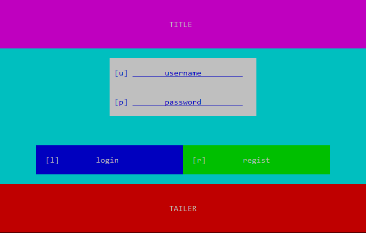

# console-ui
Pure C++, Lite weight UI Kit for POSIX terminal.

## Describe UI in Pure C++ language

With simple code, you can describe an interface like this:



code:

```cpp
void description(Canvas *cv)
{
    cv->setBackground(Cyan);

    cv->add(new Label(-100, 5, "TITLE", Magenta, White));
    cv->endHeader();

    cv->add(new TextField(-40, 3, "username", 'u', false, White, Blue));
    cv->add(new TextField(-40, 3, "password", 'p', true, White, Blue));
    
    cv->add(new Padding(-40, 3));

    cv->beginHorizontal();
    cv->add(new Button(-40, 3, "login", nullptr, 'l', Blue, White));
    cv->add(new Button(-40, 3, "regist", nullptr, 'r', Green, White));
    cv->endHorizontal();

    cv->beginTailer();
    cv->add(new Label(-100, 5, "TAILER", Red, White));
}
```

## Event Driven

Using or Inheritance the `Action` class, you can save data you need in the action.

- **Bind an action to a button**
  
  just pass the action in when constructing the button.
- **Combine multiple action**
  
  Construct an `Actions` class to combine two action. (They will execute in order)
- **Bind action to special events**
  
  `Canvas` provide `start` and `update` action pointer, point them to action you want to make actions on Canvas start or update.

  `TextField` provide `finish` and `entering` action pointer, point them to action you want to make actions on `TextField` been focused or user finish entering.

## Change Canvas

- Start with a Canvas by `Screen::initRoot()`

- Change Canvas by `Screen::setRoot()`

## How to use

To run the example, just

```bash
make compile_lib
make compile
make run
```

To write your own program, just keep it in the `console-ui` folder.